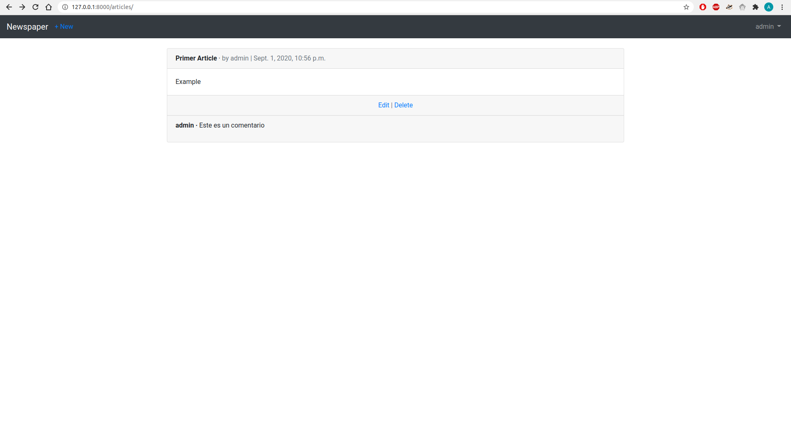

# Newspaper
Newspapaer app is a Blog application that allows users to create, edit, and delete
posts. The homepage will list all blog posts and there will be a dedicated detail page
for each individual post. Also the authenticated user can comment the posts.



## Dependencies
Python 3
Django

## Usage
```shell
python3 -m venv .env
source .env/bin/activate
pip install -r requirements.txt
```

```python
python manage.py makemigrations
python manage.py migrate
python manage.py runserver
```
## License
[This project is under MIT License](https://opensource.org/licenses/MIT)

## Book
This project was made following the book [Django for Beginners: Build websites with Python and Django](https://www.amazon.com/-/es/William-S-Vincent-ebook/dp/B079ZZLRRL) by William Vincent
